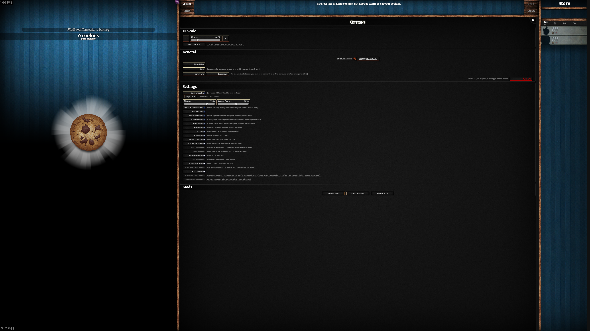
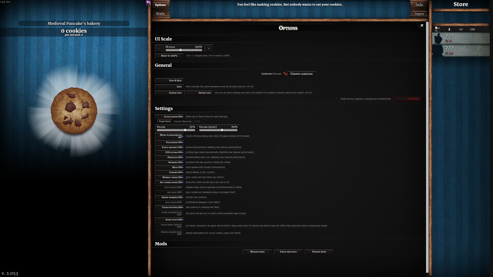

# Cookie Clicker UI Scaler

A lightweight UI scaling mod for the Steam version of Cookie Clicker.

## Features

- Configurable 50%–300% UI scaling
- Options menu controls styled like Cookie Clicker's interface
- `Ctrl` + `+` and `Ctrl` + `-` shortcuts
- `Ctrl` + `0` reset shortcut
- Machine-local scale setting that does not sync through Steam Cloud
- No CCSE dependency
- Steam achievements remain enabled
- Compatible with Cookie Clicker 2.053

## 4K examples

The screenshots below show the same 3840×2160 game window at different UI scales. Click either image to view it at full resolution.

| Default — 100% | Scaled — 150% |
|:---:|:---:|
|  |  |

## Installation

1. [Subscribe to UI Scaler on the Steam Workshop](https://steamcommunity.com/sharedfiles/filedetails/?id=3792454835).
2. Launch Cookie Clicker and open **Options → Manage Mods**.
3. Enable **UI Scaler** and restart the game when prompted.

The scale controls appear in Cookie Clicker's Options menu.

## Local development

1. Download or clone this repository.
2. Copy or symlink the `mod` folder into Cookie Clicker's `resources/app/mods/local` directory.
3. Name the installed folder `UI_Scaler`.
4. Enable **UI Scaler** from Cookie Clicker's mod manager and restart the game.

Using a symlink lets changes made in the repository appear immediately in the local mod installation.

## License

[GNU General Public License version 2](LICENSE)
